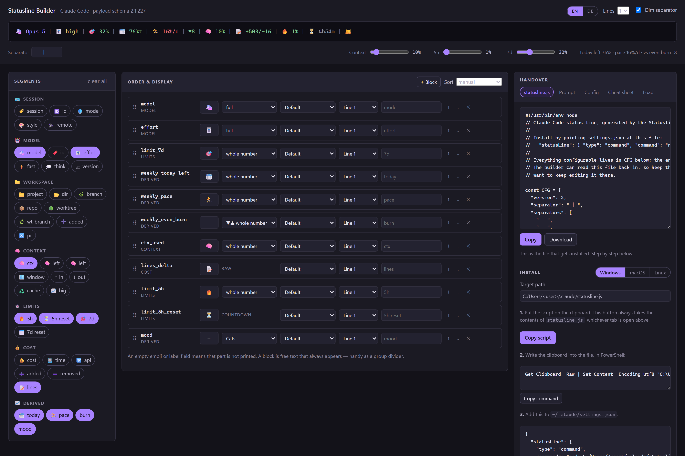
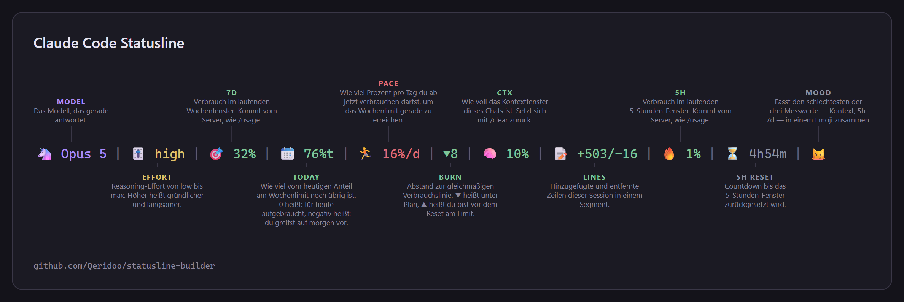

# Statusline Builder

[English](README.md) · **Deutsch**

Die Claude-Code-Statusline im Browser zusammenstellen: Segmente wählen, sortieren,
gestalten — und als lauffähiges Skript, als Übergabe-Prompt für Claude oder als
Config exportieren, die sich später wieder einlesen lässt. Die Oberfläche gibt es
auf Deutsch und Englisch.

**[Builder öffnen →](https://qeridoo.github.io/statusline-builder/)**



Alternativ `index.html` per Doppelklick öffnen. Kein Build-Schritt, kein Server,
keine Netzwerkzugriffe: alles steckt in dieser einen Datei.

## Eine Zeile bauen

- **Labels** — jede Zeile hat ein Label-Feld. Leer lassen heißt: es wird nichts
  gedruckt; steht etwas drin, wird genau dieser Text verwendet. Aus `ctx` kann so
  `kontext` oder `k` werden. Das Emoji-Feld verhält sich genauso: leer heißt kein
  Emoji.
- **Blöcke** — `+ Block` fügt ein Segment ein, das nur freier Text ist. Anders als
  ein echtes Segment wird es **immer** gedruckt und eignet sich damit als fester
  Trenner zwischen Gruppen. Per Drag & Drop an die gewünschte Stelle ziehen.
- **Trenner je Zeile** — jede Zeile hat ihr eigenes Trennerfeld, mit den üblichen
  Zeichen als Vorschlag und beliebigem Freitext.
- **Tooltips** — beim Überfahren oder Fokussieren eines Segments erscheint, was der
  Wert bedeutet und aus welchem Payload-Feld er kommt.
- **Bestehende Zeile laden** — der Tab **Laden** liest ein von diesem Werkzeug
  erzeugtes `statusline.js` (der `CFG`-Block wird herausgelöst) oder eine gesicherte
  Config-JSON, eingefügt oder als Datei. Eine handgeschriebene Bash-Statusline lässt
  sich nicht übernehmen; die App sagt das, statt still zu scheitern.

Alles liegt im `localStorage`, die Seite öffnet also dort, wo du aufgehört hast.

## Das Cheatsheet

Der Tab **Cheatsheet** rendert deine Zeile mit einer Erklärung an jedem Segment, als
SVG oder PNG zum Aufheben oder Teilen.



Die Beschriftungen wechseln sich über und unter der Zeile ab und werden in so wenige
Reihen gepackt, wie überschneidungsfrei möglich ist — das Layout hält also bei fünf
Segmenten genauso wie bei fünfzehn.

## Warum Node und nicht jq

Die meisten Statusline-Skripte rufen für jedes Feld `jq` auf. Das ist langsam —
zwanzig `jq`-Prozesse pro Render — und es scheitert lautlos, wenn `jq` nicht
installiert ist: jedes Feld bleibt leer und die Statusline rendert eine leere Zeile.

Das erzeugte Skript ist reines Node ohne Abhängigkeiten. Gemessen unter Windows 11:

| Ansatz | Kosten pro Render |
|---|---|
| Node, ein Prozess | ~80 ms |
| `bash` allein, vor dem ersten `jq`-Aufruf | ~68 ms |
| PowerShell | ~250–400 ms |

## Installation

Der Installationsblock in der App führt mit den passenden Befehlen für deine
Plattform durch die Schritte; oben Windows, macOS oder Linux wählen.

**1. Skript kopieren.** Dafür den Knopf **Skript kopieren** im Installationsblock
nehmen, nicht den Kopieren-Knopf über den Tabs. Er nimmt immer das erzeugte Skript,
egal welcher Tab gerade offen ist — kopierst du versehentlich den **Config**-Tab,
landet eine JSON-Datei in der Datei, die Node nicht ausführen kann.

**2. In die Datei schreiben.** Ohne Download; diese Befehle lesen die Zwischenablage
direkt:

| Plattform | Befehl |
|---|---|
| Windows (PowerShell) | `Get-Clipboard -Raw \| Set-Content -Encoding utf8 "C:\Users\<du>\.claude\statusline.js"` |
| macOS | `pbpaste > "$HOME/.claude/statusline.js"` |
| Linux (X11) | `xclip -selection clipboard -o > "$HOME/.claude/statusline.js"` |

Unter Wayland tritt `wl-paste` an die Stelle von `xclip -selection clipboard -o`.

**3. `~/.claude/settings.json` darauf zeigen lassen.**

```json
"statusLine": {
  "type": "command",
  "command": "node \"C:/Users/<du>/.claude/statusline.js\""
}
```

Unter macOS und Linux genügt `node ~/.claude/statusline.js` — der Befehl läuft durch
eine Shell, die die Tilde auflöst. Unter Windows nicht, dort gehört der volle Pfad
hinein.

Der Befehl muss mit `node` beginnen. Kommst du von einem `bash …/statusline.sh`-
Eintrag, ist es leicht, nur den Pfad zu ändern und `bash` stehen zu lassen; dann
läuft weiter das alte Skript und die Leiste bleibt leer. Die `.sh` selbst kann
liegen bleiben — sobald `settings.json` woanders hinzeigt, ruft sie niemand mehr auf.

**4. Gegenprobe.** Die erste Zeile der Datei muss `#!/usr/bin/env node` sein:

```bash
head -1 ~/.claude/statusline.js                                  # macOS, Linux
Get-Content "C:\Users\<du>\.claude\statusline.js" -TotalCount 1  # Windows
```

Ein führendes `{` heißt: es wurde der Config-Tab kopiert statt des Skripts.

Alles Konfigurierbare steht im erzeugten Skript oben im `CFG`-Objekt, bleibt also
von Hand editierbar — und der Tab **Laden** liest es wieder ein.

## Der Payload

Die Feldnamen stammen aus der Claude-Code-Binary, Version 2.1.227. Optionale
Schlüssel sind mit `?` markiert.

```
session_id, transcript_path, cwd, prompt_id, permission_mode, agent_id, agent_type
effort?: { level }                      low | medium | high | xhigh | max
session_name?
model: { id, display_name }
workspace: { current_dir, project_dir, added_dirs[], git_worktree?, repo? }
version
output_style: { name }
cost: { total_cost_usd, total_duration_ms, total_api_duration_ms,
        total_lines_added, total_lines_removed }
context_window: { total_input_tokens, total_output_tokens, context_window_size,
                  current_usage: { input_tokens, output_tokens,
                                   cache_creation_input_tokens,
                                   cache_read_input_tokens },
                  used_percentage, remaining_percentage }
exceeds_200k_tokens, fast_mode
thinking: { enabled }
rate_limits?: { five_hour?: { used_percentage, resets_at },
                seven_day?: { used_percentage, resets_at } }
vim?:      { mode }
agent?:    { name }
remote?:   { session_id }
pr?:       { number, url, review_state?, kind? }
worktree?: { name, path, branch, original_cwd, original_branch }
```

Es gibt genau zwei Rate-Limit-Buckets: `five_hour` und `seven_day`. Ein
Fünf-Tage-Limit existiert nicht. `resets_at` wird als Epoch-Sekunden, Epoch-
Millisekunden oder ISO-String akzeptiert.

## Abgeleitete Werte

Vier Werte im Katalog stehen nicht im Payload. Sie werden aus dem Wochen-Bucket
berechnet: `U` ist `seven_day.used_percentage`, `R` ist `resets_at`, `f` der
verstrichene Anteil des Sieben-Tage-Fensters.

| Segment | Beispiel | Formel |
|---|---|---|
| `weekly_even_burn` | `▼10` | `U − f·100`, dargestellt als `▼` unter und `▲` über der Linie |
| `weekly_pace` | `17%/d` | `(100 − U) / verbleibende Tage` — was ab jetzt pro Tag drin ist |
| `weekly_today_left` | `73%t` | Tagesindex `d = ⌊f·7⌋`, Anteil `s = 100/7`, heute verbraucht `U − d·s`, Ergebnis `(s − heute)/s · 100` |
| `mood` | `😼` | der schlechteste Wert aus Kontext %, 5h % und 7d %, auf eine Emoji-Skala abgebildet |

`weekly_today_left` ist bei 100 gedeckelt, kann aber negativ werden — unter null
heißt, dass der heutige Verbrauch schon den morgigen Anteil angreift.

Der Wert ist außerdem eine **Näherung**. Der Payload enthält keine Historie, die
Rechnung nimmt also an, dass der Verbrauch vor heute der gleichmäßigen Linie folgte.
Wer montags viel und seitdem nichts verbraucht hat, sieht einen zu niedrigen Wert.
`weekly_even_burn` ist exakt und für die Woche insgesamt die verlässlichere Zahl.

## Entwicklung

```bash
npm test        # node --test — 142 Tests
node build.js   # erzeugt index.html neu aus src/
./test.sh pfad/zu/statusline.js   # schickt sample-payload.json durch ein erzeugtes Skript
```

Aufbau der Quellen:

| Datei | Zuständigkeit |
|---|---|
| `src/i18n.js` | sämtliche Oberflächentexte auf Englisch und Deutsch |
| `src/format.js` | Wertformatierer; jeder gibt `null` zurück, was er nicht darstellen kann |
| `src/derive.js` | die Wochen-Verbrauchsrechnung |
| `src/color.js` | feste, Schwellen- und Verlaufsfarben sowie ANSI-Umhüllung |
| `src/catalog.js` | der Segmentkatalog — alle 44 Segmente als Daten, mit Erklärungen |
| `src/render.js` | Config plus Payload zu Terminalausgabe oder Vorschau-Markup |
| `src/cheatsheet.js` | Callout-Layout und das annotierte SVG |
| `src/runtime.js` | die eigenständige Engine im erzeugten Skript |
| `src/generate.js` | die Exportformate und die Leser, die sie rückgängig machen |
| `src/state.js` | ein Zustandsobjekt, gesichert im `localStorage` |
| `src/ui.js`, `src/ui-export.js` | Katalog, Builder-Zeilen, Vorschau, Export-Panel |
| `build.js` | entfernt Imports und Exports, fügt alles zu `index.html` zusammen |

### Zur doppelten Runtime

`src/runtime.js` wiederholt die Logik von `format.js`, `derive.js`, `color.js` und
`render.js` als String, weil die erzeugte Datei in `~/.claude` liegt und
eigenständig laufen muss. Diese Dopplung wird nicht geglaubt, sondern abgesichert:
`test/generate.test.js` rendert dieselbe Config über beide Wege — einmal per
`renderAnsi`, einmal durch tatsächliches Ausführen des erzeugten Skripts als
Unterprozess — und prüft, dass beide Ausgaben byteidentisch sind, über jedes Segment
des Katalogs. Wer den einen Weg ohne den anderen ändert, bekommt einen roten Test.

Das erzeugte Skript respektiert `SL_NOW` (Epoch-Millisekunden), damit diese
Vergleiche reproduzierbar sind.

### Oberfläche ohne Browser testen

`test/ui-smoke.test.js` lässt das gebaute Bundle gegen einen kleinen DOM-Ersatz in
`node:vm` laufen. Die Element-IDs stammen aus `index.template.html` statt aus einer
gepflegten Liste — ein Tippfehler in einer der beiden Dateien lässt
`getElementById` `null` liefern und `mount()` scheitern.

Dieser Ersatz prüft Verhalten, nicht Darstellung: Er meldet ein Element bereitwillig
als versteckt, während CSS es weiter anzeigen würde. Layout, Überschneidungen und
Sichtbarkeit brauchen einen echten Browser.

## Lizenz

MIT
